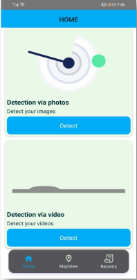

# Road Potholes Detection By Using Machine Learning

## Preface
In a project, our objective is to save citizens. We developed a system in which you can detect or recognize road potholes by using ML(Machine Learning) through the camera. You not only recognize or detect the pothole by using this system/ project you can also predict the life span of the roads, which is useful to keep our cities infrastructure better in the future. We chose this project for the safety of the public life as well as their assets/vehicles. Because of the prediction of the road lifespan contractors or road repairing companies easily got data. During the creation of the project, we learn many things. We also faced some difficulties during the project, but later, we came up with a solution with the help of our FYP(final Year Project) supervisor or some friends and colleagues.

## Abstract
In modern urban environments, road safety and infrastructure maintenance are critical concerns. Potholes, often caused by climate change and poor construction, are a leading factor in vehicle damage and traffic accidents. Manual detection methods are inefficient, costly, and time-consuming. This project proposes a machine learning-based solution to automate the detection and recognition of road potholes using real-time image processing. Leveraging YOLOv2 (You Only Look Once) for object detection and OpenCV (CV2) for image preprocessing, our mobile-based system enables efficient pothole detection through a camera feed. It predicts road lifespan based on detected conditions. The system aims to support road users and municipal authorities by reducing human effort and enhancing preventive maintenance strategies. It achieves over 90% detection accuracy in real-time testing scenarios, demonstrating its effectiveness as a scalable, cost-efficient solution for urban infrastructure monitoring.

## Problem Statement
A pothole is defined as a bowl-shaped depression in the pavement surface. Due to bad road conditions of roads or a pothole on roads, we sees a incidents of roads accident as well as vehicle damaging is increase day by day. Not only this, we also analyze that roads aren’t repaired instantly because contractors or repairing companies need many technicians for the manual collection of data and many working
hours for a rough estimation of damage on the roads for planning of reparation and rehabilitation of the roads.	The cost-effectiveness of the overall patching operation is affected by material, labor, and equipment costs. The key of decision-making for future reconstruction is an estimation of damage from collected information.

Nowadays, practice, sophisticated digital inspection vehicles are used to collect pavement images and video data, but the estimation of damage is reviewed manually by technicians. It’s a time-consuming and costly task. Usually, you need sophisticated equipment, which is very expensive and usually requires special maintenance.

## Objectives
Our objectives in the project are to deliver an application that is useful for normal users(citizens) and also useful for the administration or responsible department of the infrastructure of the city. By using this Application, people can detect potholes through a camera as well as see the lifespan prediction of the roads through image processing with accuracy, which is helpful for the administration of the cities. Also, they can mention a damaged area of that particular road to notify other users of that application.

## Project Demonstration

#### Splash and Welcome Screen: 
The application opens with a splash screen displaying the logo and project title "Potholes Detection". 
A friendly robot greets the user with a “Hello!” and a “Get Started” button, engagingly introducing the user to the application.

#### Home and Map View Screen: 
Users can upload or select images and videos from their device to detect potholes using the YOLOv5 machine learning model integrated into the app.
Detected potholes can be marked on the map, allowing users to view affected roads and choose alternative routes, enhancing road safety and awareness.

#### Recent History and Detection Result Screen: 
Displays a log of users' previously reported potholes, showing road conditions over time. New users can view updates and track changes, helping them stay informed about frequently used routes.
This screen displays real-time detection results using the YOLOv5 model, highlighting potholes in the uploaded images or videos for quick and accurate analysis.

## References
1. Hao Xia, Yanyou Qiao, Jun Jian and Yuanfei Chang, “Using Smart Phone Sensors to Detect Trans- portation Modes,” Sensors 2014, Available: http://dx.doi.org/10.3390/s141120843
2. Ozlem Durmaz Incel, Mustafa Kose and Cem Ersoy, “A Review and Taxonomy of Activity Recognition on Mobile Phones,” BioNanoSci. (2013) 3: 145. Available: http://dx.doi.org/10.1007/s12668-013-0088-3
3. Muhammad Shoaib, Hans Scholten and P. J. M. Havinga, “Towards Physical Activity Recognition Using Smartphone Sensors,” 2013 IEEE 10th International Conference on Ubiquitous Intelligence and Computing and 2013 IEEE 10th International Conference on Autonomic and Trusted Computing, Vietri sul Mere, 2013, pp. 80-87. Available: http://dx.doi.org/10.1109/UIC-ATC.2013.43
4. Wanmin Wu, Sanjoy Dasgupta, Ernesto E. Ramirez, Carlyn Peterson and Gregory J. Norman, “Clas- sification Accuracies of Physical Activities Using Smartphone Motion Sensors,” in Journal of Medical Internet Research, 2012. Available:http://dl.acm.org/citation.cfm?id=2071458
5. Wolfgang Hu¨rst and Matthias Helder, “Mobile 3D Graphics and Virtual Reality Interaction,” in ACE ’11 Proceedings of the 8th International Conference on Advances in Computer Entertainment Technology (ACM New York, 2011), Article No. 28. Available:http://dx.doi.org/10.2196/jmir.2208
6. Takeo Kanade, “First-person, inside-out vision,” Keynote speech, Proceedings of 2009 IEEE Computer Vision and Pattern Recognition Workshops: 1st Workshop on Egocentric Vision (CVPR’09), 2009.
7. Akihiro Tsukada, Motoki Shino, Michael Devyver and Takeo Kanade, “Illumination-Free Gaze Es- timation Method for First-Person Vision Wearable Device,” 2011 IEEE International Conference on Computer Vision Workshops (ICCV Workshops), Barcelona, 2011, pp. 2084-2091. Available: http://dx.doi.org/10.1109/ICCVW.2011.6130505
8. Narc´ıs Pares and David Altimira, “Analyzing the Adequacy of Interaction Paradigms in Artificial Reality Experiences,” Human-Computer Interaction, Vol. 28, March, 2013.
9. Mi  Zhang  and  Alexander  A.  Sawchuk,  “USC-HAD:  a  daily  activity  dataset  for  ubiqui- tous activity recognition using wearable sensors,” in UbiComp ’12 Proceedings of the 2012 ACM Conference on Ubiquitous Computing (ACM New York, 2012), pp. 1036-1043. Available: http://dl.acm.org/citation.cfm?id=2370438
10. Felicity Allen, Eliathamby Ambikairajah, Nigel H Lovell and Branko G Celler, “Classification of a known sequence of motions and postures from accelerometry data using adapted Gaussian mixture models” Physiological Measurement, Vol. 27, 2006. Available: http://dx.doi.org/10.1088/0967-3334/27/10/001

    

